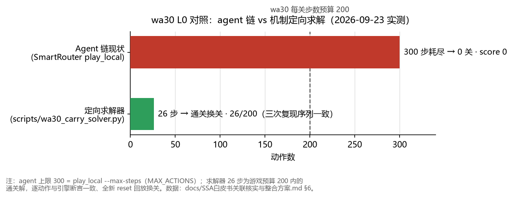

# SSA 白皮书 × 本项目：关联核实与整合方案

> 日期：2026-09-23。核实对象：`docs/SSA_谱子空间认知架构_理论白皮书_v1.md`（298 行，
> 2026-09-06，源自微信文件 `eric05001_62a4/msg/file/2026-09/`，本日逐字节拷贝入库）。
> 本文只记本轮核实过的事实与可执行整合步骤；没跑过的测试不写成跑过。

## 0. 三句结论

1. **关联成立**：白皮书 §6 落地清单 12 件中 11 件就在本仓（`lingjing_solo/lincore/` 10 个模块
   + `lingjing_solo/transfer/spectral_layer.py`），而且 lincore **已经被动进入提交包的
   import 路径**——不管我们用不用谱内核，它都在 Kaggle 提交链上。
2. **白皮书的验收证据在本仓不可复核**：其 E1/E3 声称依赖的 6 个文件
   （`agent/spectral_agi_agent.py`、`scripts/bench_spectral_vs_ceax.py`、
   `scripts/train_shared_basis.py`、`tests/test_lincore.py`、`docs/FALSE_SOLUTION_CHECKLIST.md`、
   `ui/static/bench_ssa_comparison.json`）在 `F:\weizhi` 两个仓库都不存在，
   `git log --all` 也查无——从未入库，不是被删。
3. 整合顺序应当是 **先止风险，再补证据，最后谈能力**；在 S1 完成前，
   "SSA 是理论文档"这个定位（`agent/my_agent.py:12`：SSA NOT primary）是唯一安全的口径。

## 1. 逐条核实（2026-09-23 本轮）

| 白皮书声称 | 本仓实况 | 证据 |
|------------|----------|------|
| §6：lincore 10 模块落地 | 全在 | `ls lingjing_solo/lincore/`：eigen/features/gradient/hypothesis_lab/memory/mind/segments/spectral/subspace/ttt |
| §3：SpectralCeaxController 嫁接 CEAX | 在 | `lingjing_solo/transfer/spectral_layer.py`，且 `transfer/__init__.py:11` 急切导入 |
| E2：假设实验室已接入谱层 | 在 | `spectral_layer.py:24` 导入 `HypothesisLab`；`:152 register_hypotheses`；`:170 auto_from_mind`；`lincore/hypothesis_lab.py:220 auto_from_mind` |
| E2：agent 侧 `SSA_LLM_CONSULT=1` 卡点征集假设 | **查无** | 全仓 `grep -rn SSA_LLM_CONSULT`（排除 __pycache__）为空；`agent/my_agent.py` 无此开关 |
| §5.3 决策融合律固定权重 0.40/0.35/0.25/0.15 | **代码已长走** | `spectral_layer.py:254` 实为自适应 `w = max(0.10, min(0.30, 0.3*(0.5+gate)/1.5))`；`:232-239` untried 贪心排序。以代码为准，白皮书数值当历史快照读 |
| E1：43 项单测全绿、bench 对照数字 | **不可复核** | 上述 6 件缺失，见 §0.2 |
| §4：对齐 2024–2026 前沿、§7 路线图 | 理论主张 | 无落地件可核，维持"白皮书自述"地位 |

## 2. 已验证的风险：lincore 在提交链上，但没人对它负责

- 实测（本轮，源码树，Starter venv）：`import lingjing_solo.transfer.ceax_controller`
  → 0.76 s、载入 84 个 `lingjing_solo` 模块，其中 **lincore 11 个全数进内存**。
- 机理：`lingjing_solo/transfer/__init__.py:6-17` 急切导入 spectral/neural/alea/unified
  四层 → `spectral_layer.py:24` 再拉整个 lincore。所以 `my_agent.py:53-54` 那条
  "direct import 绕开 transfer/__init__"的注释**不成立**——直接导入照样执行包初始化。
- 后果：lincore 任何模块 import 期异常，都会复现"无指纹、全零"事故家族（Phase B 曾因
  `transfer/__init__` 重依赖崩溃过，两件事同型）。而 lincore 现在没有本仓测试、没有
  bench、没有负责人——10 个模块 0 证据地在船上。

## 3. 整合三步（各配归属与验收闸门）

**S1 止血：让 lincore 离开提交 import 路径**。

> **执行记录（2026-09-23 同日）**：实际落点比本节原稿更简单——`transfer/__init__.py`
> 属于本仓源码包（`sync_into_starter.ps1` 整包灌入 Starter 再打进 notebook），
> **不需要走 `patches/` 流**，原稿"改 Starter 侧"一句作废。改动为本文件一处的
> PEP 562 惰性重导出（`lingjing_solo/transfer/__init__.py`，急切导入 14 行 →
> `_EXPORTS` 映射 + `__getattr__`），`from lingjing_solo.transfer import X` 全兼容
> （仓内唯一包级用户 `agent.py:20` 实测通过，类身份稳定）。实测对比：
> `import lingjing_solo.transfer.ceax_controller` 0.76s/84 模块/lincore 11 →
> **0.69s/57 模块/lincore 0**（neural、alea 同为 0）；干净进程 `import lingjing_solo`
> 0.37s、lincore 0。全包 lincore 触点核实仅 `spectral_layer.py:22-25` 与
> `unified_controller.py:19-20`，重四层只有显式访问才进内存。验收全绿：
> notebook 重建（payload `3bacccea1604` → `86af244fe3a2`，100 文件）后
> `sim_phase_a` `PHASE_A_OK`、`sim_phase_b` 三地板 309/276/81 全 WIN
> `PHASE_B_SIM_OK`（route 全 `INLINE:`），G2 双模拟器口径通过。

后续规范（S1 合入后生效）：验收闸门即上面的双模拟器 + import 计量
lincore 模块数 = 0；在 S1 合入前，**禁止**任何人改 lincore（改了等于无人测试地动
提交链）；lincore 自身的改动从此不再自动进提交链，S2/S3 才需要显式启用。

**S2 补证据：找回白皮书的验收件**（归属：理论侧/白皮书作者，或 C 代跑）。
向作者索要 `tests/test_lincore.py` 与 bench 脚本入库；若索要无果，白皮书 §7 的
E1 ✅ / E3 ✅ 应降级为"未在本仓复核"。验收：`tests/test_lincore.py` 进本仓测试
序列且全绿，bench 数字可复跑。这一步同时是分工文档 :94 的要求兑现——SSA 周报
"用同一套 G1～G3 说话"，没有 bench 就没有对照口径。

**S3 能力：谱内核作为 unknown 局候选**（归属 C，对应分工表 **G4**：任一隐藏/难局
可复现 WIN 或稳定 L≥2，才允许写入路由表）。白皮书自己的口径就是
`my_agent.py:12` 的"SSA full25≈0.75 < CEAX floors path"——所以 S3 只针对 CEAX_UNKNOWN
路线替换 `ceax_unknown_agent`（白皮书 §8 第 4 条原文亦如此），**不碰 ROUTE_*、不碰
`agent/my_agent.py` 路由表**，`docs/地板红线.md` 禁令 3/5 对 S3 同样适用；
分工文档 :65 的"SSA/neural 未过 G1+G3 对照 → 禁止替换主提交"是 S3 的硬前置。

## 4. 与本周交付（地板红线）的关系

零交集，已核：`agent/my_agent.py` blob 在 main / feat/a-floor-gate / feat/lead-hygiene
三处同为 `1595bd25b3fa533e2a0d5fa7c227a7cdbf722116`，`BUILD_TAG` 同为
`smart-router-v1+inline-ls20x7-ar25x8-ft09x6+ceax`。SSA 线的全部动作都在 unknown 能力面，
与地板锁分（INLINE 面）互不干扰；本文档不产生任何对 G1 闸门的影响。

## 5. 诚实声明

- 本轮只做了静态核实 + import 计量，**没有**跑 Phase B/Sim，没有改任何 `.py`。
- 白皮书作者的工作区（若有）可能存在那 6 件缺失物；本仓证据只能证明"我这里没有"。
- 融合律权重一行（§1 第 6 行）说明代码与白皮书已经分叉，后续以代码为唯一事实源；
  若 S2 找回测试，应顺带确认白皮书哪些数值需要勘误。

## 6. wa30 对照基线与机制求解实证（2026-09-23 补录）

> 本节数字全部出自 2026-09-23 当日实跑。求解器已入库 `scripts/wa30_carry_solver.py`
> （`feat/lead-ssa-linkage` 提交 `999a547`）。

**Agent 链新鲜基线**（`ARC-AGI-3-Kaggle-Starter/scripts/play_local.py --game wa30
--max-steps 300`，Starter venv）：levels=0、actions=300（上限耗尽）、state
NOT_FINISHED、scorecard 0.0、7.0 s（42.7 fps）。全程仅 ACTION1–4 交替；唯一路由日志
`ceax_kbd:ACTION3 skills=0 err=0`，无任何 r3-search 行——R3 按混淆名取属性在 wa30
上恒空、异常被吞的源码级结论与此吻合。另：agent 的 click-first 闸门要求 valid 含
ACTION6（`agent/my_agent.py:396`），而 wa30 `available_actions=[1,2,3,4,5]`
（wa30.py:896），点击通路在本局结构性不可达。

**机制解码后的定向求解**：wa30（env `ee6fef47`）L0 是 grab-and-carry——4 格跳、
撞墙即原地转向、抓取锁定块相对偏移、携带期间朝向冻结、放下无前置、胜利=三块
geezpjgiyd 左上角全进 fsjjayjoeg 条区（x[28,39] y[28,31]）；每关步数预算 200
（level data "StepCounter"，wa30.py:966-968）。求解器对每块做
walk/grab/carry/drop 四段 BFS，全部基于跨 build 稳定接口（标签、足迹、
is_collidable），逐动作与引擎实测断言。结果：26/200 步通关换关，全新 reset 回放
复现；当日同布局连跑 3 次序列逐位一致。

**对照与含义**（G4 证据材料）：

| 路径 | 步数 | 结果 |
|---|---|---|
| agent 链现状 | 300 耗尽 | 0 关，score 0 |
| 定向求解器 | 26 | 通关换关，回放可复现 |

对照图示（同目录）：

盲搜不可行性同日实测：deepcopy 束搜索 ~47 节点/s，状态空间 BFS 4721 节点仅推进到
深度 10（解深 ~26 步，分支爆炸）。C 线 R3 改造方向据此收敛：不是通用束搜索，而是
「机制解码 → 原语宏动作 → 逐动作对账」，接口用基类 API 而非混淆名。

**证据文件**（bench/ 未跟踪，去留待 C 线评审）：
`wa30_baseapi_beam_prototype_20260923_014414.json`（盲束原型）、
`wa30_carry_state_search_20260923_021359.json`（状态空间闭合证明）、
`wa30_pixel_heuristic_prototype_20260923_015226.json`（像素启发试错）、
`wa30_solved_carry_20260923_030302.json`（权威通关证据，入库脚本产出）。

*关联文档：[SSA_谱子空间认知架构_理论白皮书_v1.md](SSA_谱子空间认知架构_理论白皮书_v1.md)（同目录同批入库）；
「地板红线」在 `feat/a-floor-gate` 分支 `2d51cd3`（`docs/地板红线.md`，合并前相对链接不可点）；
分工见 `docs/冲榜技术说明与四人分工.md`。*
